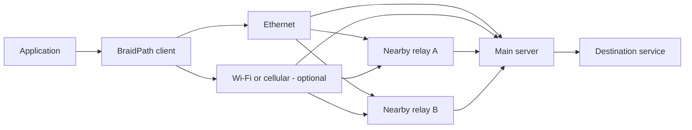

# BraidPath

**Weave paths. Repair loss. Keep latency in check.**

[](https://github.com/LiuTangLei/braidpath/actions/workflows/ci.yml)
[](LICENSE)

[简体中文](README.zh-CN.md) · [Run it](docs/runtime.md) · [Architecture](docs/architecture.md) · [Carrier design](docs/transports.md) · [Validation plan](docs/validation.md) · [Roadmap](docs/roadmap.md)

BraidPath is a Rust multipath transport project combining **forward error correction (FEC), client interface aggregation, and nearby relay entrances**. Its goal is to reduce recovery delays caused by packet loss while using available path capacity.

“Braid” means weaving several imperfect paths into a more resilient connection.

> **Status: experimental UDP tunnel.** The client, main server and fixed-target relays now run over real HTTP/3 and HTTP Datagrams, with bidirectional XOR FEC and bounded multipath scheduling. This is an engineering prototype, with no general performance or censorship-resistance guarantee.

## One interface works. Several can contribute.

The topology is:



Nearby relays provide **logical server-side entrances**, giving one main server multiple route choices. Relays forward encrypted traffic; the client and main server own the aggregate session. Each transport path returns through its own entrance. Application downlink traffic is scheduled independently of uplink traffic.

| Client interfaces | Server entrances | Intended use |
| --- | --- | --- |
| One | One | FEC on a single path |
| One | Several | Route diversity where it exists |
| Several | One | Aggregate client access links |
| Several | Several | Schedule across interface–entrance pairs |

Entrance count is not independent capacity. Paths may share the last mile, transit routes, relay backhaul, or the main server's uplink. A single interface cannot exceed its access bandwidth by adding entrances.

## Design priorities

- **Repair at the aggregate layer.** Recover across paths without waiting for retransmission when enough timely repair information is available.
- **Keep original data moving.** The encoder emits originals immediately; network transmission still obeys queue limits and congestion control.
- **Treat direction and path quality separately.** Upload quality is not evidence of download quality. A slow path must not create unbounded reordering.
- **Spend redundancy deliberately.** Measure FEC, retransmission, control traffic, and actual wire cost separately.
- **Make progress measurable.** Compare application P95/P99, deadline misses, completion and goodput under matched conditions. CPU-efficiency optimization comes later.

BBR is the default congestion controller. The initial priority is latency and useful throughput; CPU-efficiency tuning is deferred.

Each interface–entrance pair owns an end-to-end Quinn/rustls connection to the main server. HTTP/3 handles ordinary requests and authenticated session admission; unreliable HTTP Datagrams carry aggregate records. Relays forward encrypted packets to a fixed destination.

**Xray is a design reference only:** no Xray dependency, sidecar or protocol compatibility. Stock Quinn does not imitate browser fingerprints, and this prototype provides no TCP fallback. An ordinary website response does not establish GFW resistance. See the [carrier analysis](docs/transports.md).

## Build and run

Rust 1.88 or newer:

```bash
git clone https://github.com/LiuTangLei/braidpath.git
cd braidpath
cargo build --release --locked
./target/release/braidpath --help
cargo test --all-targets --locked
```

Follow the [runtime guide](docs/runtime.md) for credentials, local forwarding, multiple entrances and measurement. The independent in-memory codec example remains available with `cargo run --locked --example loss_recovery`.

| Capability | Status |
| --- | --- |
| XOR `k + 1`, immediate originals, timed partial blocks | Implemented; at most one missing original per block |
| HTTP/3 website, verified server identity, authenticated session joins | Implemented experimental profile |
| Bidirectional FEC, session deduplication, UDP forwarding | Implemented; messages up to 1,000 bytes |
| Fixed-target opaque relays with source allowlists | Implemented |
| Interface × entrance paths | Linux interface binding; default-route sockets on other platforms |
| Round-robin eligible paths, bounded queues, aggregate pacing, repair budget | Implemented baseline |
| Adaptive scheduling/FEC, coupled congestion control, automatic reconnect | Planned |
| Reliable streams, TCP, TUN, stream fallback, browser fingerprint shaping | Planned or deferred |

XOR cannot generally recover an entire failed path. Sparse traffic may exhaust the repair budget; FEC does not guarantee delivery. Multiple connections can compete unfairly at a shared bottleneck even with an aggregate rate cap. Multi-interface capacity, competition fairness, independent HTTP/3 interoperability and deployment reachability remain separate acceptance gates.

## Inspiration

We draw inspiration from [Aggligator](https://github.com/remoc-rs/aggligator), especially its link abstraction, dynamic link lifecycle, and observability. BraidPath implements its own aggregation and recovery core.

## Development

```bash
cargo fmt --all -- --check
cargo clippy --all-targets --locked -- -D warnings
cargo test --all-targets --locked
```

Start with small, reproducible changes and explicit acceptance criteria. The [roadmap](docs/roadmap.md) separates codec correctness, network integration, multipath behavior, performance, and deployment readiness.

Test records and run results stay local. The repository contains source code, automated tests, and validation methods. See [CONTRIBUTING.md](CONTRIBUTING.md).

Licensed under [Apache-2.0](LICENSE). See [NOTICE](NOTICE) for attribution.
