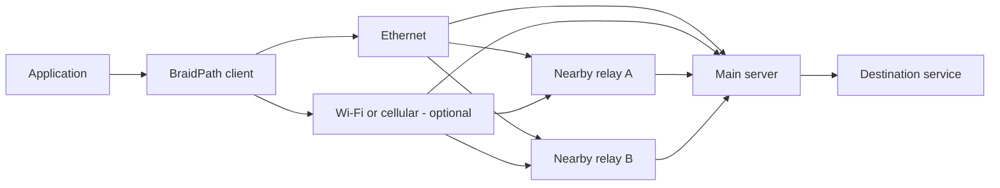

# BraidPath

**Weave paths. Repair loss. Keep latency in check.**

[](https://github.com/LiuTangLei/braidpath/actions/workflows/ci.yml)
[](LICENSE)

[简体中文](README.zh-CN.md) · [Architecture](docs/architecture.md) · [Carrier design](docs/transports.md) · [Validation plan](docs/validation.md) · [Roadmap](docs/roadmap.md)

BraidPath is a Rust multipath transport project combining **forward error correction (FEC), client interface aggregation, and nearby relay entrances**. Its goal is to reduce recovery delays caused by packet loss while using available path capacity.

“Braid” means weaving several imperfect paths into a more resilient connection.

> **Status: an algorithm foundation.** The repository contains an executable XOR FEC codec, a path identity model, and deterministic tests. Client, server, relay integration, and network scheduling are planned. There is no deployable tunnel or established real-network performance gain yet.

## One interface works. Several can contribute.

The intended topology is:



Nearby relays provide **logical server-side entrances**, giving one main server multiple route choices. Relays forward encrypted traffic; the client and main server own the aggregate session. Each transport path returns through its own entrance. Application downlink traffic is scheduled independently of uplink traffic.

| Client interfaces | Server entrances | Intended use |
| --- | --- | --- |
| One | One | FEC on a single path |
| One | Several | Route diversity where it exists |
| Several | One | Aggregate client access links |
| Several | Several | Schedule across interface–entrance pairs |

Entrance count is not independent capacity. Paths may share the last mile, transit routes, relay backhaul, or the main server's uplink. A single interface cannot exceed its access bandwidth by adding entrances.

## Design priorities

- **Repair at the aggregate layer.** Recover across paths without waiting for retransmission when enough timely repair information is available.
- **Keep original data moving.** The encoder emits originals immediately; network transmission still obeys queue limits and congestion control.
- **Treat direction and path quality separately.** Upload quality is not evidence of download quality. A slow path must not create unbounded reordering.
- **Spend redundancy deliberately.** Measure FEC, retransmission, control traffic, and actual wire cost separately.
- **Make progress measurable.** Compare application P95/P99, deadline misses, completion, goodput, and CPU under matched conditions.

The first engineering baseline uses **one end-to-end QUIC DATAGRAM connection per active path**, with Quinn as the candidate Rust implementation. QUIC provides authenticated encryption and connection-level congestion control; BraidPath owns cross-path coding and delivery.

The preferred deployment candidate adds **a real HTTP/3 service and authenticated HTTP Datagrams**, preserving unreliable delivery for FEC. BraidPath remains an independent Rust implementation: Xray is a reference for resistance to identification and probing, not a dependency, sidecar or compatibility target. A future HTTPS stream profile would have separate latency and recovery gates.

**No cross-border default or censorship-resistance claim is established.** Ordinary website behavior and encryption alone do not demonstrate GFW reachability. Complete carrier profiles must pass both reachability and performance validation. See the [carrier analysis](docs/transports.md) and [architecture](docs/architecture.md). All networking capabilities remain planned, separate from the current dependency-free core.

## Run the foundation

Rust 1.85 or newer; no third-party dependencies in the current crate.

```bash
git clone https://github.com/LiuTangLei/braidpath.git
cd braidpath
cargo test --all-targets --locked
cargo run --locked --example loss_recovery
```

The example enumerates one interface and three logical entrances **in memory**, distributes four originals and one XOR repair symbol, omits one original, and recovers all four payloads. It opens no sockets and measures no latency.

| Capability | Status |
| --- | --- |
| Systematic XOR `k + 1`, one missing original per block | Implemented |
| Immediate encoder output and caller-driven deadline flush | Implemented |
| Unequal lengths, reordering, per-block deduplication | Implemented |
| Interface × entrance identifiers | Implemented; no OS binding yet |
| Encrypted datagrams and authorized session joining | Planned |
| Bidirectional relays and real interface binding | Planned |
| Scheduling, redundancy budgets, adaptive FEC | Planned |
| Session recovery, flow control, TCP/UDP adapters | Planned |

The XOR codec is a baseline, not the final algorithm. It cannot generally recover a whole failed path. Sparse traffic creates short blocks with potentially high repair overhead. FEC does not eliminate congestion or guarantee delivery; reliable streams require additional recovery and flow control.

## Inspiration

We draw inspiration from [Aggligator](https://github.com/remoc-rs/aggligator), especially its link abstraction, dynamic link lifecycle, and observability. BraidPath implements its own aggregation and recovery core.

## Development

```bash
cargo fmt --all -- --check
cargo clippy --all-targets --locked -- -D warnings
cargo test --all-targets --locked
```

Start with small, reproducible changes and explicit acceptance criteria. The [roadmap](docs/roadmap.md) separates codec correctness, network integration, multipath behavior, performance, and deployment readiness.

Test records and run results stay local. The repository contains source code, automated tests, and validation methods. See [CONTRIBUTING.md](CONTRIBUTING.md).

Licensed under [Apache-2.0](LICENSE). See [NOTICE](NOTICE) for attribution.
