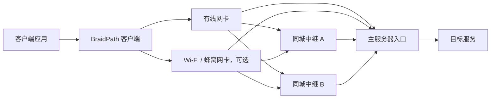

# BraidPath

**Weave paths. Repair loss. Keep latency in check.**

[](https://github.com/LiuTangLei/braidpath/actions/workflows/ci.yml)
[](LICENSE)

[English](README.md) · [运行指南](docs/runtime.md) · [架构设计](docs/architecture.md) · [传输方案](docs/transports.md) · [验证计划](docs/validation.md) · [路线图](docs/roadmap.md)

BraidPath 是一个从零构建的 Rust 多路径传输项目，目标是通过 **前向纠错（FEC）、客户端多网卡聚合和同城多服务器中继**，降低丢包造成的恢复等待与尾延迟，同时利用多条路径的可用带宽。

“Braid” 是编织：把多条不完美的路径编成一条更稳定的连接。

> **当前阶段：可运行的实验性 UDP 隧道。** 已实现客户端、主服务器、固定目标中继、真正的 HTTP/3 与 HTTP Datagrams、双向 XOR FEC 和有界多路径调度。尚不承诺通用性能提升或抗封锁效果。

## 一张网卡可以用，多张网卡可以聚合

拓扑如下：



同地点的多台服务器给主服务器提供多个**逻辑网络入口**，在传输层模拟多网卡可选路径。中继只转发加密报文，主服务器统一处理会话、纠错和交付；每条路径的传输回程经过对应入口。业务下行独立调度，不必与上行选择同一条路径。

| 客户端接口 | 服务端入口 | 目标用途 |
| --- | --- | --- |
| 1 | 1 | 单路径也能用 FEC 降低部分丢包的恢复等待 |
| 1 | 多个 | 利用不同入口的路由差异，调度和分散修复流量 |
| 多个 | 1 | 聚合有线、Wi-Fi、蜂窝等客户端路径 |
| 多个 | 多个 | 在“客户端接口 × 服务端入口”之间调度 |

多个入口可能共享客户端最后一公里、运营商路由或主服务器带宽。**入口数量不等于独立带宽数量。** 单网卡多入口不能突破自身接入带宽；路径分散能否改善丢包，必须实测。

## 我们要解决什么

- **丢包后的等待**：在聚合层发出修复信息，争取不等一次重传往返就恢复数据。
- **慢路径拖累**：按预计到达时间、排队、丢包和路径健康状态调度，减少重排等待。
- **两端能力不对称**：客户端可以多网卡，主服务器可以通过同城中继扩展逻辑入口。
- **冗余失控**：分别统计业务数据、FEC、补发与控制流量，用可观测的预算换取延迟收益。
- **“跑得快”缺少证据**：同时检查 P50/P95/P99、完成率、有效吞吐和开销；上下行分别验证，CPU 占用优化后置。

FEC 是恢复手段，不能消除拥塞或保证零丢包。聚合默认分发不同数据，全部复制属于单独的策略选择。

## 构建与运行

默认使用 BBR，初版优先延迟和有效吞吐，CPU 占用后续再优化。

需要 Rust 1.88 或更新版本：

```bash
git clone https://github.com/LiuTangLei/braidpath.git
cd braidpath
cargo build --release --locked
./target/release/braidpath --help
cargo test --all-targets --locked
```

凭据、单路径转发、多入口和测量命令见[运行指南](docs/runtime.md)。内存编码示例仍可通过 `cargo run --locked --example loss_recovery` 运行。

| 能力 | 当前状态 |
| --- | --- |
| XOR `k + 1`、立即输出原始包、定时封块 | 已实现；每块最多恢复一个丢失原始包 |
| HTTP/3 页面、服务端证书验证、会话认证 | 已实现实验协议 |
| 双向 FEC、会话去重、UDP 转发 | 已实现；单消息最多 1,000 字节 |
| 固定目标密文中继、客户端来源白名单 | 已实现 |
| 客户端接口 × 服务端入口 | Linux 可明确绑定接口；其他系统暂用默认路由 |
| 可用路径轮询、有界队列、总速率和修复预算 | 已实现基础版本 |
| 自适应调度/FEC、耦合拥塞控制、自动重连 | 待实现 |
| 可靠流、TCP、TUN、流承载回退、浏览器指纹整形 | 待实现或后置 |

XOR 通常无法恢复整条路径故障造成的所有丢包；低频流量可能耗尽修复预算。FEC 不保证可靠交付。总速率上限也不等于共享瓶颈公平性，多网卡容量、竞争公平性、独立 HTTP/3 实现互通和真实部署可达性仍需分别验收。

## 从 Aggligator 学到什么

我们借鉴 [Aggligator](https://github.com/remoc-rs/aggligator) 的多链路抽象、动态链路管理、统一交付与链路统计思路；这些能力会按本项目的 datagram-first 架构逐步实现。

BraidPath 独立实现聚合与修复核心；当前工程基线使用 QUIC DATAGRAM，复用认证加密和拥塞控制，FEC 在聚合层工作。

已实现的实验性部署候选在此基础上提供**真正的 HTTP/3 服务与经过认证的 HTTP Datagrams**，保留 FEC 所需的不可靠交付语义。**Xray 只作为防识别、防探测的设计参考，不是依赖、配套运行程序或协议兼容目标。** 客户端、主服务器、聚合和传输适配由本项目独立以 Rust 实现；未来如增加 HTTPS 流承载，须单独验收其重传和排队代价。

正常网站响应和加密本身不能证明抗封锁。跨境默认方案尚未确定，完整承载必须同时通过真实网络可达性与性能验证。详见[传输方案分析](docs/transports.md)。当前使用原生 Quinn，不具备浏览器指纹模拟或 TCP 回退能力。

架构、验证计划与路线图使用英文维护。测试记录与运行结果仅在本地保存，仓库保留自动化测试代码和验证方法。

## 开发与参与

```bash
cargo fmt --all -- --check
cargo clippy --all-targets --locked -- -D warnings
cargo test --all-targets --locked
```

优先贡献可复现的场景、清楚定义的指标和小范围实现。后续网络版本从“单接口直连 → 单接口多入口 → 多接口多入口”逐步验收；不会直接把实验室机制测试称为公网可用。

代码按 [Apache-2.0](LICENSE) 许可发布。来源和致谢见 [NOTICE](NOTICE)。
