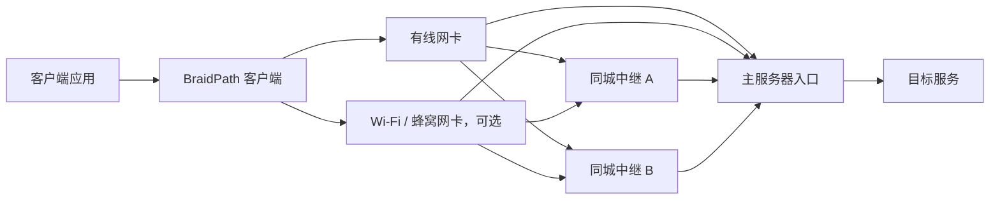

# BraidPath

**Weave paths. Repair loss. Keep latency in check.**

[](https://github.com/LiuTangLei/braidpath/actions/workflows/ci.yml)
[](LICENSE)

[English](README.md) · [架构设计](docs/architecture.md) · [验证计划](docs/validation.md) · [路线图](docs/roadmap.md)

BraidPath 是一个从零构建的 Rust 多路径传输项目，目标是通过 **前向纠错（FEC）、客户端多网卡聚合和同城多服务器中继**，降低丢包造成的恢复等待与尾延迟，同时利用多条路径的可用带宽。

“Braid” 是编织：把多条不完美的路径编成一条更稳定的连接。

> **当前阶段：可运行的算法基础原型。** 已有小块 XOR FEC、即时原始包输出、按期限封块、单块去重和路径身份模型。尚无可部署的客户端、主服务器或中继程序，也没有真实网络性能承诺。

## 一张网卡可以用，多张网卡可以聚合

目标拓扑如下；图中的网络连接属于后续实现：



同地点的多台服务器给主服务器提供多个**逻辑网络入口**，在传输层模拟多网卡可选路径。中继只转发加密报文，主服务器统一处理会话、纠错和交付；每条路径的传输回程经过对应入口。业务下行独立调度，不必与上行选择同一条路径。

| 客户端接口 | 服务端入口 | 目标用途 |
| --- | --- | --- |
| 1 | 1 | 单路径也能用 FEC 降低部分丢包的恢复等待 |
| 1 | 多个 | 利用不同入口的路由差异，调度和分散修复流量 |
| 多个 | 1 | 聚合有线、Wi-Fi、蜂窝等客户端路径 |
| 多个 | 多个 | 在“客户端接口 × 服务端入口”之间调度 |

多个入口可能共享客户端最后一公里、运营商路由或主服务器带宽。**入口数量不等于独立带宽数量。** 单网卡多入口不能突破自身接入带宽；路径分散能否改善丢包，必须实测。

## 我们要解决什么

- **丢包后的等待**：在聚合层发出修复信息，争取不等一次重传往返就恢复数据。
- **慢路径拖累**：按预计到达时间、排队、丢包和路径健康状态调度，减少重排等待。
- **两端能力不对称**：客户端可以多网卡，主服务器可以通过同城中继扩展逻辑入口。
- **冗余失控**：分别统计业务数据、FEC、补发与控制流量，用可观测的预算换取延迟收益。
- **“跑得快”缺少证据**：同时检查 P50/P95/P99、完成率、有效吞吐、开销和 CPU；上下行分别验证。

FEC 是恢复手段，不能消除拥塞或保证零丢包。聚合默认分发不同数据，全部复制属于单独的策略选择。

## 已经能运行什么

需要 Rust 1.85 或更新版本；当前核心没有第三方依赖。

```bash
git clone https://github.com/LiuTangLei/braidpath.git
cd braidpath
cargo test --all-targets --locked
cargo run --locked --example loss_recovery
```

示例在内存中建立“1 个客户端接口、3 个逻辑入口”的路径列表，发送四个不同的数据包与一个 XOR 修复包，主动丢弃一个数据包，再恢复全部四个包。路径分发只是轮询演示，没有实际网络收发。

```text
4/4 packets delivered; one erasure repaired without retransmission.
Synthetic codec example only; no network performance claim.
```

| 能力 | 当前状态 |
| --- | --- |
| 系统式 XOR FEC，`k + 1` | 已实现；每块最多恢复一个数据包丢失 |
| 编码器立即输出原始包、短块按期限封块 | 已实现；调用方须驱动定时器 |
| 不同长度数据包、乱序、重复包 | 已实现并测试；只在单块生命周期内去重 |
| 单网卡 / 多网卡 × 多入口身份 | 已实现候选组合；尚未绑定真实网卡 |
| QUIC DATAGRAM 收发、入口转发、双向会话 | 规划中 |
| 自适应 FEC、多包恢复、滑动窗口 | 规划中 |
| 路径测量、调度、拥塞控制、重传 | 规划中 |
| 认证、加密、防重放、TCP/UDP 隧道 | 规划中 |

当前 `k + 1` 编码器只提供机制基线，**不代表最终算法选择**。短块可能只有一个原始包，这时一个修复包就接近整包复制成本。单块多包丢失或整条路径故障需要额外恢复策略。编码器立即输出不等于立即上网：发送仍受队列与拥塞控制约束。还没有硬性冗余预算，也没有生产网络安全边界。

## 从 Aggligator 学到什么

我们借鉴 [Aggligator](https://github.com/remoc-rs/aggligator) 的多链路抽象、动态链路管理、统一交付与链路统计思路；这些能力会按本项目的 datagram-first 架构逐步实现。

BraidPath 独立实现聚合与修复核心；第一条网络路线计划使用 QUIC DATAGRAM 承载每条路径，复用认证加密和拥塞控制，FEC 在聚合层工作。该网络路线尚未实现。

架构、验证计划与路线图使用英文维护。测试记录与运行结果仅在本地保存，仓库保留自动化测试代码和验证方法。

## 开发与参与

```bash
cargo fmt --all -- --check
cargo clippy --all-targets --locked -- -D warnings
cargo test --all-targets --locked
```

优先贡献可复现的场景、清楚定义的指标和小范围实现。后续网络版本从“单接口直连 → 单接口多入口 → 多接口多入口”逐步验收；不会直接把实验室机制测试称为公网可用。

代码按 [Apache-2.0](LICENSE) 许可发布。来源和致谢见 [NOTICE](NOTICE)。
