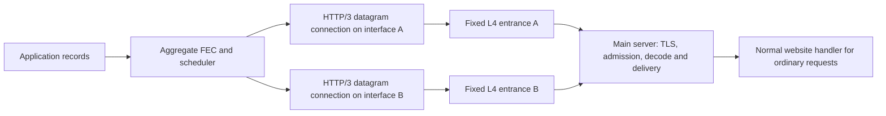

# Carrier design: lessons from Xray

**Decision:** build an independent Rust HTTP/3 service with an authenticated, unreliable datagram data plane as the preferred deployment candidate. Keep plain QUIC DATAGRAM as an engineering control. Use REALITY/XHTTP as research examples for a separately evaluated HTTPS stream profile when UDP is unusable. None is a validated deployment default yet.

**Xray is a design reference only.** BraidPath will not depend on, embed, launch or require Xray. Xray protocol compatibility is not a project goal. The aggregation, FEC, scheduler and carrier integration belong to BraidPath; established Rust networking and cryptographic libraries remain appropriate dependencies.

This preserves BraidPath's purpose: timely repair across independently usable paths. A carrier that withholds later records until an earlier record is retransmitted changes that purpose, even if its application-facing API accepts UDP messages.

## What the source actually provides

The references below pin Xray-core to [8989adf](https://github.com/XTLS/Xray-core/tree/8989adfd3ffd7eac72b557018c403a2edeb1a6d4), rather than assuming every installed release has the same features. The relevant REALITY, Vision, XUDP, XHTTP and Hysteria files also match the inspected `v26.9.30` tag; that release is marked **prerelease**. MASQUE has subsequent changes. These are source references and design conclusions, not benchmark results.

| Xray component | Relevant behavior | Consequence for BraidPath |
| --- | --- | --- |
| REALITY | TLS-derived handshake, client fingerprint selection, custom peer verification and forwarding of unauthenticated connections to a configured target | Useful compatibility reference; not a QUIC DATAGRAM security layer |
| XTLS Vision | Recognizes inner TLS and conditionally switches to direct copying; raw TCP splice has platform and connection restrictions | Its optimized HTTPS forwarding path is not automatically available for FEC records |
| XHTTP | HTTP request/response bodies; H3 still uses reliable streams; packet-up restores sequence order | Useful HTTP reachability option, but missing bytes can delay later records on the affected stream |
| XUDP | Encodes datagram boundaries and session metadata into a reader/writer | Does not remove TCP or HTTP-stream ordering below it |
| Hysteria transport plus Hysteria UDP proxy | HTTP/3 authentication, actual QUIC DATAGRAM send/receive, normal HTTP handler for other requests | Closest existing Xray reference for the low-latency candidate |
| MASQUE | CONNECT-IP over H3 uses HTTP Datagrams; H2 uses stream-carried capsules | Another datagram reference only in the H3 configuration; importing its full IP tunnel is unnecessary for the initial record service |
| UDP FinalMask | Packet transforms such as Salamander; some variants add fragmentation/padding | Changes the observable protocol and overhead; random-looking UDP is not ordinary HTTPS |

Evidence: [REALITY](https://github.com/XTLS/Xray-core/blob/8989adfd3ffd7eac72b557018c403a2edeb1a6d4/transport/internet/reality/reality.go), [Vision eligibility](https://github.com/XTLS/Xray-core/blob/8989adfd3ffd7eac72b557018c403a2edeb1a6d4/proxy/vless/outbound/outbound.go#L250-L291), [Vision copying](https://github.com/XTLS/Xray-core/blob/8989adfd3ffd7eac72b557018c403a2edeb1a6d4/proxy/proxy.go#L620-L780), [XHTTP ordering](https://github.com/XTLS/Xray-core/blob/8989adfd3ffd7eac72b557018c403a2edeb1a6d4/transport/internet/splithttp/upload_queue.go#L63-L118), [XUDP framing](https://github.com/XTLS/Xray-core/blob/8989adfd3ffd7eac72b557018c403a2edeb1a6d4/common/xudp/xudp.go#L92-L175), [Hysteria datagrams](https://github.com/XTLS/Xray-core/blob/8989adfd3ffd7eac72b557018c403a2edeb1a6d4/transport/internet/hysteria/conn.go#L198-L294), [HTTP handler](https://github.com/XTLS/Xray-core/blob/8989adfd3ffd7eac72b557018c403a2edeb1a6d4/transport/internet/hysteria/hub.go#L44-L119), [MASQUE carrier selection](https://github.com/XTLS/Xray-core/blob/8989adfd3ffd7eac72b557018c403a2edeb1a6d4/transport/internet/masque/connectip/conn.go#L592-L614), [Salamander](https://github.com/XTLS/Xray-core/blob/8989adfd3ffd7eac72b557018c403a2edeb1a6d4/transport/internet/finalmask/salamander/salamander.go).

H3 removes TCP's connection-wide ordering dependency between independent streams, but bytes within each HTTP body remain ordered. For example, if original A is lost and repair R follows A in the same reliable stream, R cannot reach BraidPath first. A repair on a genuinely separate path may still help; the stalled carrier nevertheless continues its own retransmission and consumes capacity. Thus FEC over streams is not necessarily useless, but its cost and usefulness must be measured separately.

## Preferred datagram profile

The intended data path is:

One interface and one entrance remain valid. Each active interface–entrance pair gets its own transport connection and bounded sender. The encrypted connection terminates at the main server. The same connection provides transport congestion control and carries the source/repair records; **do not put the existing Quinn connection inside another QUIC proxy**. Nested transports would add queues, headers and competing control loops.

A real HTTP/3 endpoint must negotiate and implement HTTP/3, serve normal requests, and authenticate the tunnel operation before accepting BraidPath data. Merely advertising `h3`, changing ports or setting a browser User-Agent does not implement this. Maintain an ordinary HTTPS service on TCP as well if the deployment presents itself as a website, with consistent domain/certificate and content behavior; this alone does not implement a TCP tunnel fallback.

Use server certificate verification and client credentials inside the protected application exchange for this profile. Do not require every website visitor to present a client certificate. The operator-managed mTLS design remains suitable for the plain-QUIC engineering profile. Both profiles must enforce the same authenticated client identity, session-join authorization, epoch and resource limits. Disable early application data initially.

Implement a native Rust HTTP/3 adapter using [HTTP Datagrams](https://www.rfc-editor.org/rfc/rfc9297.html). Define the authenticated request, context mapping, negotiated settings, session join and error behavior explicitly. Deliver records directly to the main server's aggregate service. Compare it with the plain-QUIC adapter using the same controller and resource limits. The adapter must expose bounded admission, actual maximum message size and usable path observations.

Candidate components are Quinn/rustls with [h3](https://docs.rs/h3/0.0.8/h3/server/struct.Builder.html), [h3-quinn](https://docs.rs/h3-quinn/0.0.10/h3_quinn/) and [h3-datagram](https://docs.rs/h3-datagram/0.0.2/h3_datagram/). They expose the necessary protocol building blocks; they do not provide Xray's handshake shaping. The h3 project [describes its APIs as experimental](https://github.com/hyperium/h3#status), so pin compatible versions and test negotiation, cancellation, interoperability and platform support before selecting the runtime. The experimental runtime now uses pinned h3/h3-quinn APIs with Quinn/rustls and its own bounded HTTP Datagram framing. See the [runtime guide](runtime.md) for the implemented POST mapping and outstanding acceptance gates.

[CONNECT-UDP](https://www.rfc-editor.org/rfc/rfc9298.html) is a possible standard mapping if a UDP proxy interface becomes useful; it is not required for the initial direct record handler. Xray's inspected MASQUE implementation is CONNECT-IP and serves here only to illustrate the H3-datagram versus H2-stream distinction. A generic IP tunnel, proxy sidecar and multiple production wire profiles are outside M1.

## What a web-facing profile cannot inherit for free

**Fingerprint behavior.** Xray's Hysteria client uses a modified QUIC implementation with `ChromeParrot`, including TLS ClientHello, transport parameters and Initial packet handling. The dependency is pinned in [go.mod](https://github.com/XTLS/Xray-core/blob/8989adfd3ffd7eac72b557018c403a2edeb1a6d4/go.mod). Its [configuration](https://github.com/apernet/quic-go/blob/184d081eef3e9edd5cb7c0ddf2460c91f2e6adb1/interface.go#L180-L207) and [parameter encoding](https://github.com/apernet/quic-go/blob/184d081eef3e9edd5cb7c0ddf2460c91f2e6adb1/internal/wire/transport_parameters_chrome.go) are additional behavior beyond stock Quinn. This is implementation evidence, not proof of indistinguishability from a browser.

Configuration can also override transport windows and handshake parameters. The fork contains a non-standard option to assume DATAGRAM support when a peer omits negotiation; the inspected Chrome profile itself restores advertisement of DATAGRAM support. Do not copy one switch without tracing the effective configuration. A standards-based adapter must require negotiation and pass independent-peer interoperability checks.

**Visibility.** HTTP/3 content encryption does not conceal the destination IP, every handshake attribute, packet sizes, timing or connection lifetime. QUIC Initial packets do not provide established-session secrecy. A working website and correct unauthorized-request handling improve protocol consistency; they do not demonstrate resistance to traffic classification, targeted blocking or all active probes. [RFC 9001](https://www.rfc-editor.org/rfc/rfc9001.html#section-5) motivates a separate deployment gate.

FEC and multipath scheduling also change visible packet sizes, cadence and concurrent connection patterns. Evaluate the full active workload, not only an idle handshake. Any padding or timing changes introduced for appearance consume the same byte/latency budget; they must not hold urgent originals merely to obtain a preferred traffic shape.

**Path independence.** XHTTP's [XMUX](https://github.com/XTLS/Xray-core/blob/8989adfd3ffd7eac72b557018c403a2edeb1a6d4/transport/internet/splithttp/mux.go) reuses transport clients, and Hysteria's [client manager](https://github.com/XTLS/Xray-core/blob/8989adfd3ffd7eac72b557018c403a2edeb1a6d4/transport/internet/hysteria/dialer.go#L272-L350) reuses connections for matching destination/settings. Multiple logical proxy sessions can therefore share one failure and congestion domain. Explicit interface binding, distinct connection ownership and packet captures must establish BraidPath's paths. Up/down separation and proxy load balancing are not themselves aggregation of one flow across several interfaces.

**Relay appearance.** Public TURN framing outside QUIC does not look like direct HTTP/3. For the web-facing profile, evaluate fixed-destination L4 forwarding that preserves the main server's handshake and return path. The main server authenticates proxy use; ordinary website traffic may pass without proxy credentials. Relays must allow only the configured main service address/port, bound mapping state and rate, and expose no client-selected destination. This is a separate deployment design from authenticated TURN allocation. Backhaul and main-server capacity still bound the aggregate.

**Congestion and copying.** Xray supports BBR and fixed-rate Brutal variants. Start comparisons with a congestion-responsive configuration and explicit shared-bottleneck limits. A fixed-rate sender, extra connections or more parity can improve one flow by taking bandwidth from competitors. Neither that result nor Vision's eligible TCP copy path proves a better FEC scheduler. FEC still needs CPU, memory access and redundancy bytes even when implemented in Rust.

**Masks and intermediaries.** Salamander-style randomization is a separately named UDP profile. It replaces the visible HTTP/3 packet format, so normal HTTP/3 clients cannot reach the same masked listener directly. Do not enable it while claiming the unmasked website behavior. Likewise, ordinary CDN HTTPS support does not establish support for extended CONNECT or HTTP Datagrams. A TLS-terminating intermediary also changes the trust boundary; the initial topology keeps termination on the main server.

## Compatibility profile

If UDP reachability requires it, a future native HTTPS stream adapter can carry length-delimited BraidPath records. REALITY and XHTTP illustrate the relevant camouflage and ordering trade-offs; they are not dependencies or required wire protocols. Preserve message IDs, bounded queues and session authorization. Report this mode explicitly, including whether the underlying connection is TCP/H2 or a QUIC stream. Do not silently treat it as an unreliable path or reuse datagram latency claims.

Independent compatibility connections may still distribute work and carry repairs around a stalled connection. They cannot cancel bytes already retained by TCP/QUIC-stream recovery. Default to conservative redundancy until matched tests show that additional repair offsets the extra traffic. Do not mix this profile into a datagram coding group automatically in the first implementation.

REALITY is not a drop-in QUIC handshake; a new "REALITY over QUIC" would be a separate protocol/security project. Use established TLS libraries rather than inventing cryptography. Xray-core is [MPL-2.0](https://github.com/XTLS/Xray-core/blob/8989adfd3ffd7eac72b557018c403a2edeb1a6d4/LICENSE). This design adopts concepts and does not incorporate its code or create an Xray interoperability requirement.

## Selection gate

The [carrier acceptance tests](validation.md#carrier-semantics-and-cost-gate) are a prerequisite for choosing a deployment carrier, not an optional check after building the scheduler. They must establish:

1. Correct delivery semantics, authentication and ordinary HTTP behavior.
2. Bounded queues, cancellation, negotiated sizes and independent path ownership.
3. Matched goodput, application deadlines/tail latency, total wire cost and CPU.
4. FEC benefit under actual packet loss, with both directions and shared bottlenecks.
5. Repeated reachability on the intended networks before a deployment claim.

These gates can reject the preferred candidate. If web appearance or compatibility costs consume the expected recovery benefit, retain the simpler controlled-network profile and keep the deployment claim unresolved. Test records, local integration probes, captures and endpoint details remain outside version control.
